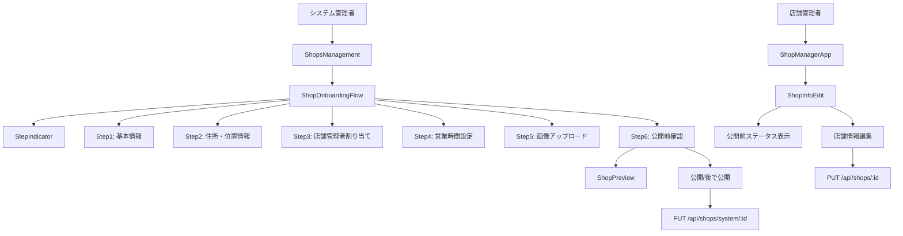
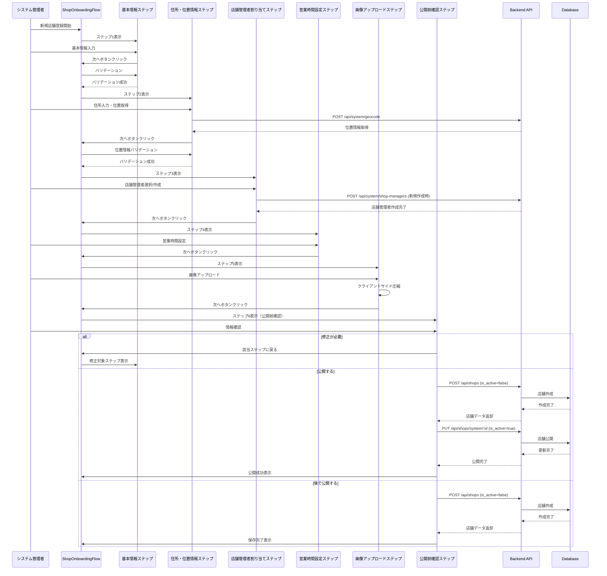
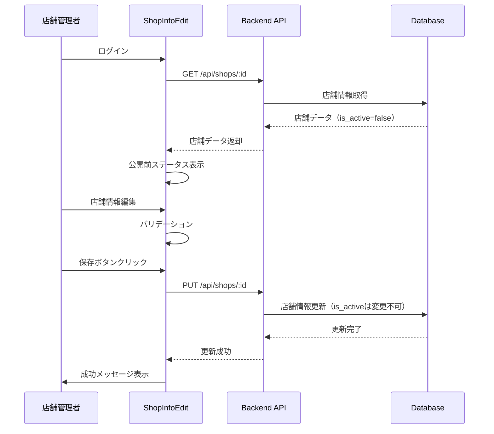

# Technical Design Document

## Overview

この機能は、新規店舗登録から利用者アプリへの公開までのフローを整理し、UI/UXを改善することで、システム管理者と店舗管理者がスムーズに店舗を登録・公開できるようにします。ステップバイステップのガイド、公開前の確認機能、明確な進捗表示により、登録プロセスの透明性と使いやすさを向上させます。

**ユーザー**: システム管理者と店舗管理者がこの機能を利用します。システム管理者は新規店舗を登録し、公開前確認を行い、店舗を公開します。店舗管理者は公開前の店舗情報を確認・編集できます。

**影響**: 既存の単一モーダル形式の店舗登録フォーム（`ShopFormModal`）を、ステップバイステップのマルチステップフローに拡張します。また、公開前確認画面と進捗インジケーターを追加し、店舗管理者向けの公開前編集機能を既存の`ShopInfoEdit`コンポーネントに統合します。

### Goals

- システム管理者が直感的に店舗を登録できるステップバイステップフローの実装
- 公開前確認画面による登録情報の検証機能
- 進捗インジケーターによる透明性の向上
- 店舗管理者による公開前情報の確認・編集機能
- 既存の実装パターンと技術スタックとの整合性維持

### Non-Goals

- 店舗管理者への自動通知機能（将来実装）
- 複数画像のアップロード（現時点では1枚のみ）
- 店舗情報のバージョン管理・履歴機能
- 店舗登録の承認ワークフロー（システム管理者が直接公開可能）

## Architecture

### Existing Architecture Analysis

既存のシステムは以下のアーキテクチャパターンに従っています：

- **フロントエンド**: React 19 + TypeScript + Vite、コンポーネントベースの設計
- **状態管理**: React Context API + TanStack React Query
- **UIライブラリ**: shadcn/ui（Radix UIベース）
- **バックエンド**: Node.js + Express + TypeScript、RESTful API
- **データベース**: PostgreSQL、リレーショナル設計

既存の店舗登録実装：
- `ShopFormModal`: 単一モーダル形式のフォーム
- `ShopFormFields`: 住所・位置情報入力コンポーネント
- `ShopManagerSection`: 店舗管理者割り当てコンポーネント
- `useImageCompression`: 画像圧縮フック（既存実装を再利用）
- `PostalCodeInput`: 郵便番号検索コンポーネント（既存実装を再利用）

既存のAPI：
- `POST /api/shops`: 店舗作成（is_active = falseで作成）
- `PUT /api/shops/system/:id`: 店舗更新（is_active変更可能）
- `POST /api/system/shop-managers`: 店舗管理者作成
- `GET /api/system/postal-code/:code`: 郵便番号検索
- `POST /api/system/geocode`: 住所から位置情報取得

### High-Level Architecture



**アーキテクチャ統合**:
- 既存パターン維持: モーダルベースのUI、React Queryによるデータフェッチ、shadcn/uiコンポーネントの再利用
- 新規コンポーネント: `ShopOnboardingFlow`（マルチステップフォーム）、`StepIndicator`（進捗表示）、`ShopPreview`（プレビュー表示）、`BusinessHoursForm`（営業時間設定）
- 技術スタック整合性: 既存のReact 19、TypeScript、Tailwind CSSパターンを維持
- ステアリング準拠: 既存のコンポーネント組織パターンとファイル命名規則に従う

### Technology Alignment

この機能は既存の技術スタックに完全に整合しています：

**フロントエンド技術**:
- React 19.1.1: コンポーネントベースのUI実装
- TypeScript ~5.9.3: 型安全性の確保
- Tailwind CSS ^3.4.18: スタイリング
- shadcn/ui: UIプリミティブの再利用
- TanStack React Query ^5.90.7: サーバー状態管理

**既存ライブラリの再利用**:
- `useImageCompression`フック: 画像圧縮機能（最大800x600、JPEG品質80%）
- `PostalCodeInput`コンポーネント: 郵便番号検索
- `apiService`: API通信（既存のgeocode、searchPostalCode、createShop、updateShopメソッドを利用）

**新規依存関係**: なし（既存のライブラリのみを使用）

**バックエンド技術**:
- 既存のAPIエンドポイントを拡張・再利用
- 新規APIエンドポイントは不要（既存の`PUT /api/shops/system/:id`でis_active更新を実現）

### Key Design Decisions

**Decision 1: ステップバイステップフローの実装方式**
- **Context**: 単一モーダル形式では情報量が多く、ユーザーが混乱しやすい
- **Alternatives**: 
  1. 既存の`ShopFormModal`をそのまま拡張（シンプルだがUXが劣る）
  2. 完全に新しいコンポーネントを作成（既存コードとの重複が発生）
  3. 既存コンポーネントを再利用しつつ、ステップ管理ロジックを追加（推奨）
- **Selected Approach**: 既存の`ShopFormFields`、`ShopManagerSection`などのサブコンポーネントを再利用し、新しい`ShopOnboardingFlow`コンポーネントでステップ管理を行う
- **Rationale**: コードの重複を避け、既存の実装を最大限活用できる。保守性が高い
- **Trade-offs**: 既存コンポーネントのインターフェースを維持する必要があるが、柔軟性は若干制限される

**Decision 2: フォーム状態管理の方式**
- **Context**: マルチステップフォームでは、各ステップの状態を保持し、前のステップに戻れる必要がある
- **Alternatives**:
  1. 各ステップで個別に状態管理（状態の同期が複雑）
  2. グローバル状態（Context API）で一元管理（過剰設計の可能性）
  3. 親コンポーネントで状態を一元管理し、各ステップにpropsで渡す（推奨）
- **Selected Approach**: `ShopOnboardingFlow`コンポーネント内で`useState`を使用してフォーム状態を一元管理し、各ステップコンポーネントに必要なデータと更新関数をpropsで渡す
- **Rationale**: シンプルで理解しやすく、Reactの標準的なパターンに従う。状態の一貫性が保証される
- **Trade-offs**: コンポーネントの階層が深くなるが、状態管理の複雑さは最小限に抑えられる

**Decision 3: 公開前確認画面の実装方式**
- **Context**: 登録完了前にすべての情報を確認し、修正可能にする必要がある
- **Alternatives**:
  1. 別画面に遷移（ルーティングが必要、モーダルの一貫性が失われる）
  2. モーダル内の最終ステップとして実装（推奨）
  3. 外部の確認ページを作成（既存パターンと異なる）
- **Selected Approach**: モーダル内の最終ステップ（Step 6）として実装し、確認画面とプレビューを表示。修正が必要な場合は該当ステップに戻る機能を提供
- **Rationale**: 既存のモーダルパターンと一貫性を保ち、ユーザー体験をスムーズにする。ルーティングの複雑さを避けられる
- **Trade-offs**: モーダルが大きくなるが、スクロール可能な設計で対応可能

## System Flows

### 店舗登録フロー（システム管理者）



### 店舗管理者による公開前編集フロー



## Requirements Traceability

| Requirement | Requirement Summary | Components | Interfaces | Flows |
|-------------|---------------------|------------|------------|-------|
| 1.1 | 複数ステップに分割された登録フォーム | ShopOnboardingFlow, StepIndicator | - | 店舗登録フロー |
| 1.2 | 進捗の視覚的表示 | StepIndicator | - | 店舗登録フロー |
| 1.3 | 前のステップに戻る機能 | ShopOnboardingFlow | - | 店舗登録フロー |
| 1.4 | 必須項目バリデーション | 各ステップコンポーネント | - | 店舗登録フロー |
| 1.5 | 登録完了画面 | ShopOnboardingFlow (Step 6) | - | 店舗登録フロー |
| 2.1-2.7 | 店舗基本情報入力の改善 | ShopBasicInfoStep, ShopFormFields | POST /api/system/geocode | 店舗登録フロー |
| 3.1-3.5 | 店舗管理者の割り当て | ShopManagerStep, ShopManagerSection | POST /api/system/shop-managers | 店舗登録フロー |
| 4.1-4.5 | 営業時間設定の改善 | BusinessHoursStep | - | 店舗登録フロー |
| 5.1-5.5 | 店舗画像アップロードの改善 | ImageUploadStep, useImageCompression | - | 店舗登録フロー |
| 6.1-6.6 | 公開前確認・プレビュー機能 | PreviewStep, ShopPreview | POST /api/shops, PUT /api/shops/system/:id | 店舗登録フロー |
| 7.1-7.5 | 必須項目の明確化とバリデーション | 各ステップコンポーネント | - | 店舗登録フロー |
| 8.1-8.5 | 登録進捗の視覚的表示 | StepIndicator | - | 店舗登録フロー |
| 9.1-9.4 | 公開後の確認と通知 | PreviewStep | - | 店舗登録フロー |
| 10.1-10.5 | エラーハンドリングとガイダンス | 各ステップコンポーネント, ErrorBoundary | - | 店舗登録フロー |
| 11.1-11.11 | 店舗管理者による公開前情報の確認と編集 | ShopInfoEdit (拡張) | PUT /api/shops/:id | 店舗管理者編集フロー |

## Components and Interfaces

### Frontend Components

#### ShopOnboardingFlow

**Responsibility & Boundaries**
- **Primary Responsibility**: マルチステップの店舗登録フローを管理し、各ステップ間の遷移と状態管理を行う
- **Domain Boundary**: システム管理者向け店舗登録ドメイン
- **Data Ownership**: 店舗登録フォームの全ステップの状態データを保持
- **Transaction Boundary**: フォーム送信時に店舗作成APIを呼び出し、成功時のみ状態をクリア

**Dependencies**
- **Inbound**: `ShopsManagement`コンポーネントから呼び出される
- **Outbound**: 各ステップコンポーネント（`ShopBasicInfoStep`、`AddressLocationStep`、`ShopManagerStep`、`BusinessHoursStep`、`ImageUploadStep`、`PreviewStep`）、`StepIndicator`、`useImageCompression`フック、`apiService`
- **External**: なし

**Contract Definition**

**Component Interface**:
```typescript
interface ShopOnboardingFlowProps {
  isOpen: boolean;
  onClose: () => void;
  onComplete: (shop: Shop) => void;
  shopManagers: ShopManager[];
}

interface ShopFormData {
  // Step 1: 基本情報
  name: string;
  description: string;
  category: 'restaurant' | 'cafe' | 'izakaya';
  
  // Step 2: 住所・位置情報
  postalCode: string;
  address: string;
  formattedAddress: string;
  placeId: string;
  latitude: number;
  longitude: number;
  phone: string;
  email: string;
  
  // Step 3: 店舗管理者
  shop_manager_id: string;
  newManagerData?: {
    username: string;
    email: string;
    password: string;
    firstName: string;
    lastName: string;
    phone: string;
  };
  managerMode: 'existing' | 'new';
  
  // Step 4: 営業時間
  business_hours: BusinessHours;
  
  // Step 5: 画像
  image_url: string;
}

interface BusinessHours {
  [key: string]: {
    open: string;
    close: string;
    nextDay?: boolean;
    closed?: boolean;
  };
}
```

- **Preconditions**: `isOpen`が`true`の場合、モーダルが表示される。`shopManagers`は既に取得済みであること
- **Postconditions**: フォーム送信成功時、`onComplete`コールバックが呼ばれ、モーダルが閉じられる
- **Invariants**: 現在のステップは常に1から6の間の値。フォームデータは各ステップ間で保持される

**State Management**:
- **State Model**: `currentStep`（1-6）、`formData`（ShopFormData型）、`errors`（各フィールドのエラーメッセージ）
- **Persistence**: モーダルが開いている間はメモリ内で保持。モーダルを閉じると状態がリセットされる
- **Concurrency**: 単一ユーザーのみが操作するため、競合状態は発生しない

#### StepIndicator

**Responsibility & Boundaries**
- **Primary Responsibility**: 登録フローの進捗状況を視覚的に表示する
- **Domain Boundary**: UI表示ドメイン
- **Data Ownership**: 表示用の状態のみ（ステップ番号、完了状態）
- **Transaction Boundary**: なし（表示のみ）

**Dependencies**
- **Inbound**: `ShopOnboardingFlow`から呼び出される
- **Outbound**: なし
- **External**: なし

**Contract Definition**

**Component Interface**:
```typescript
interface StepIndicatorProps {
  currentStep: number;
  totalSteps: number;
  completedSteps: number[];
  onStepClick?: (step: number) => void;
}
```

- **Preconditions**: `currentStep`は1以上`totalSteps`以下の値
- **Postconditions**: ステップの状態に応じて視覚的に表示が更新される
- **Invariants**: `completedSteps`には常に`currentStep`未満のステップ番号が含まれる

#### ShopBasicInfoStep

**Responsibility & Boundaries**
- **Primary Responsibility**: 店舗の基本情報（店舗名、説明、カテゴリ）を入力する
- **Domain Boundary**: 店舗登録ドメイン
- **Data Ownership**: 基本情報フィールドの入力状態のみ
- **Transaction Boundary**: なし（親コンポーネントに状態を渡すのみ）

**Dependencies**
- **Inbound**: `ShopOnboardingFlow`から呼び出される
- **Outbound**: なし
- **External**: なし

**Contract Definition**

**Component Interface**:
```typescript
interface ShopBasicInfoStepProps {
  formData: {
    name: string;
    description: string;
    category: 'restaurant' | 'cafe' | 'izakaya';
  };
  onChange: (field: string, value: any) => void;
  errors: Record<string, string>;
  onNext: () => void;
  onBack?: () => void;
}
```

- **Preconditions**: `formData`が提供される
- **Postconditions**: `onNext`が呼ばれると、バリデーションが実行され、成功時は次のステップに進む
- **Invariants**: 店舗名は200文字以内。カテゴリは3つの選択肢のいずれか

#### AddressLocationStep

**Responsibility & Boundaries**
- **Primary Responsibility**: 住所と位置情報を入力・取得する
- **Domain Boundary**: 店舗登録ドメイン
- **Data Ownership**: 住所・位置情報フィールドの入力状態のみ
- **Transaction Boundary**: 位置情報取得時にAPIを呼び出す

**Dependencies**
- **Inbound**: `ShopOnboardingFlow`から呼び出される
- **Outbound**: `PostalCodeInput`、`ShopFormFields`、`apiService.geocode`
- **External**: zipcloud API（郵便番号検索）、Google Maps Geocoding API（位置情報取得）

**Contract Definition**

**Component Interface**:
```typescript
interface AddressLocationStepProps {
  formData: {
    postalCode: string;
    address: string;
    formattedAddress: string;
    placeId: string;
    latitude: number;
    longitude: number;
    phone: string;
    email: string;
  };
  onChange: (field: string, value: any) => void;
  errors: Record<string, string>;
  onNext: () => void;
  onBack: () => void;
}
```

- **Preconditions**: `formData`が提供される
- **Postconditions**: 位置情報が取得され、`latitude`と`longitude`が設定されていないと次のステップに進めない
- **Invariants**: 緯度経度は必ずペアで設定される。電話番号とメールアドレスは形式バリデーションが実行される

**External Dependencies Investigation**:
- **zipcloud API**: 無料の郵便番号検索API。既存実装で使用中。レート制限なし（非商用利用）
- **Google Maps Geocoding API**: 既存実装で使用中。APIキーはバックエンドで管理。レート制限あり（1日あたりのリクエスト数に制限）

#### ShopManagerStep

**Responsibility & Boundaries**
- **Primary Responsibility**: 店舗管理者を既存から選択または新規作成する
- **Domain Boundary**: 店舗登録ドメイン
- **Data Ownership**: 店舗管理者選択状態のみ
- **Transaction Boundary**: 新規店舗管理者作成時にAPIを呼び出す

**Dependencies**
- **Inbound**: `ShopOnboardingFlow`から呼び出される
- **Outbound**: `ShopManagerSection`、`apiService.createShopManager`
- **External**: なし

**Contract Definition**

**Component Interface**:
```typescript
interface ShopManagerStepProps {
  formData: {
    shop_manager_id: string;
    newManagerData?: {
      username: string;
      email: string;
      password: string;
      firstName: string;
      lastName: string;
      phone: string;
    };
    managerMode: 'existing' | 'new';
  };
  shopManagers: ShopManager[];
  onChange: (field: string, value: any) => void;
  errors: Record<string, string>;
  onNext: () => void;
  onBack: () => void;
}
```

- **Preconditions**: `shopManagers`リストが提供される
- **Postconditions**: 店舗管理者が選択または作成され、`shop_manager_id`が設定される
- **Invariants**: `managerMode`が`'new'`の場合、新規店舗管理者の必須項目が入力されている必要がある

#### BusinessHoursStep

**Responsibility & Boundaries**
- **Primary Responsibility**: 営業時間を各曜日ごとに設定する
- **Domain Boundary**: 店舗登録ドメイン
- **Data Ownership**: 営業時間設定状態のみ
- **Transaction Boundary**: なし（親コンポーネントに状態を渡すのみ）

**Dependencies**
- **Inbound**: `ShopOnboardingFlow`から呼び出される
- **Outbound**: なし
- **External**: なし

**Contract Definition**

**Component Interface**:
```typescript
interface BusinessHoursStepProps {
  formData: {
    business_hours: BusinessHours;
  };
  onChange: (field: string, value: any) => void;
  errors: Record<string, string>;
  onNext: () => void;
  onBack: () => void;
}
```

- **Preconditions**: `formData.business_hours`が提供される
- **Postconditions**: 営業時間が設定される（未設定の場合はデフォルト値9:00-21:00が適用される）
- **Invariants**: 時刻形式は`HH:mm`。終了時刻が翌日にまたがる場合は`nextDay`フラグが設定される

#### ImageUploadStep

**Responsibility & Boundaries**
- **Primary Responsibility**: 店舗画像をアップロードし、クライアントサイドで圧縮する
- **Domain Boundary**: 店舗登録ドメイン
- **Data Ownership**: 画像データ（Base64エンコード文字列）のみ
- **Transaction Boundary**: なし（親コンポーネントに状態を渡すのみ）

**Dependencies**
- **Inbound**: `ShopOnboardingFlow`から呼び出される
- **Outbound**: `useImageCompression`フック
- **External**: なし

**Contract Definition**

**Component Interface**:
```typescript
interface ImageUploadStepProps {
  formData: {
    image_url: string;
  };
  onChange: (field: string, value: any) => void;
  errors: Record<string, string>;
  onNext: () => void;
  onBack: () => void;
}
```

- **Preconditions**: `formData`が提供される
- **Postconditions**: 画像が選択され、圧縮され、`image_url`にBase64文字列が設定される
- **Invariants**: 画像形式はJPEGまたはPNG。最大ファイルサイズは5MB。圧縮後は最大800x600ピクセル、JPEG品質80%

#### PreviewStep

**Responsibility & Boundaries**
- **Primary Responsibility**: 登録情報を確認し、公開前プレビューを表示する
- **Domain Boundary**: 店舗登録ドメイン
- **Data Ownership**: 表示用のデータのみ（フォームデータの参照）
- **Transaction Boundary**: 店舗作成・公開時にAPIを呼び出す

**Dependencies**
- **Inbound**: `ShopOnboardingFlow`から呼び出される
- **Outbound**: `ShopPreview`、`apiService.createShop`、`apiService.updateShop`
- **External**: なし

**Contract Definition**

**Component Interface**:
```typescript
interface PreviewStepProps {
  formData: ShopFormData;
  onEdit: (step: number) => void;
  onPublish: () => Promise<void>;
  onSaveDraft: () => Promise<void>;
  isSubmitting: boolean;
}
```

- **Preconditions**: すべてのステップが完了し、`formData`が完全に設定されている
- **Postconditions**: `onPublish`または`onSaveDraft`が呼ばれると、店舗が作成され、必要に応じて公開される
- **Invariants**: 店舗作成は常に`is_active=false`で開始され、公開時のみ`is_active=true`に更新される

#### ShopPreview

**Responsibility & Boundaries**
- **Primary Responsibility**: 利用者アプリでの店舗表示をプレビューする
- **Domain Boundary**: UI表示ドメイン
- **Data Ownership**: 表示用のデータのみ
- **Transaction Boundary**: なし（表示のみ）

**Dependencies**
- **Inbound**: `PreviewStep`から呼び出される
- **Outbound**: なし
- **External**: なし

**Contract Definition**

**Component Interface**:
```typescript
interface ShopPreviewProps {
  shop: ShopFormData;
}
```

- **Preconditions**: `shop`データが提供される
- **Postconditions**: 利用者アプリでの表示と同様のプレビューが表示される
- **Invariants**: プレビューは読み取り専用。編集機能は提供しない

#### ShopInfoEdit (拡張)

**Responsibility & Boundaries**
- **Primary Responsibility**: 店舗管理者が店舗情報を編集する（既存コンポーネントを拡張）
- **Domain Boundary**: 店舗管理ドメイン
- **Data Ownership**: 店舗情報の編集状態
- **Transaction Boundary**: 保存時にAPIを呼び出す

**Dependencies**
- **Inbound**: `ShopManagerApp`から呼び出される
- **Outbound**: `apiService.updateShop`、既存の`ShopFormFields`、`useImageCompression`
- **External**: なし

**Integration Strategy**:
- **Modification Approach**: 既存の`ShopInfoEdit`コンポーネントに公開前ステータス表示と編集機能を追加
- **Backward Compatibility**: 既存の編集機能は維持される
- **Migration Path**: 既存コンポーネントに条件分岐を追加し、`is_active=false`の場合に公開前ステータスを表示

**Contract Definition**

**Component Interface**:
```typescript
// 既存のインターフェースを拡張
interface ShopInfoEditProps {
  // 既存のprops
  shop: Shop;
  
  // 新規追加
  showPublishStatus?: boolean; // 公開前ステータスを表示するか
  canEditPublishStatus?: boolean; // 公開状態を編集可能か（店舗管理者はfalse）
}
```

- **Preconditions**: `shop`データが提供される。店舗管理者は自分の店舗のみ編集可能
- **Postconditions**: 店舗情報が更新されるが、`is_active`は変更されない（店舗管理者の場合）
- **Invariants**: 店舗管理者は`is_active`を変更できない。必須項目のバリデーションは実行される

### Backend Components

既存のAPIエンドポイントを再利用するため、新規のバックエンドコンポーネントは不要です。

**既存APIの使用**:
- `POST /api/shops`: 店舗作成（is_active=falseで作成）
- `PUT /api/shops/system/:id`: 店舗更新・公開（is_active=trueに更新可能）
- `PUT /api/shops/:id`: 店舗更新（店舗管理者用、is_active変更不可）
- `POST /api/system/shop-managers`: 店舗管理者作成
- `GET /api/system/postal-code/:code`: 郵便番号検索
- `POST /api/system/geocode`: 住所から位置情報取得

## Data Models

### Logical Data Model

既存のデータベーススキーマをそのまま使用します。変更は不要です。

**主要テーブル**:
- `shops`: 店舗情報（既存スキーマ）
  - `id`: UUID (PRIMARY KEY)
  - `name`: VARCHAR(200) NOT NULL
  - `description`: TEXT
  - `address`: VARCHAR(500) NOT NULL
  - `postal_code`: VARCHAR(10)
  - `formatted_address`: VARCHAR(500)
  - `place_id`: VARCHAR(255)
  - `phone`: VARCHAR(20)
  - `email`: VARCHAR(255)
  - `category`: VARCHAR(50) NOT NULL CHECK (category IN ('restaurant', 'cafe', 'izakaya'))
  - `latitude`: DECIMAL(10, 8) NOT NULL
  - `longitude`: DECIMAL(11, 8) NOT NULL
  - `business_hours`: JSONB
  - `image_url`: TEXT
  - `is_active`: BOOLEAN DEFAULT false
  - `shop_manager_id`: UUID REFERENCES shop_managers(id)
  - `created_at`: TIMESTAMP WITH TIME ZONE
  - `updated_at`: TIMESTAMP WITH TIME ZONE

- `shop_managers`: 店舗管理者（既存スキーマ）
  - `id`: UUID (PRIMARY KEY)
  - `username`: VARCHAR(50) UNIQUE NOT NULL
  - `email`: VARCHAR(255) UNIQUE NOT NULL
  - `password_hash`: VARCHAR(255) NOT NULL
  - `first_name`: VARCHAR(50) NOT NULL
  - `last_name`: VARCHAR(50) NOT NULL
  - `phone`: VARCHAR(20)
  - `is_active`: BOOLEAN DEFAULT true
  - `created_at`: TIMESTAMP WITH TIME ZONE
  - `updated_at`: TIMESTAMP WITH TIME ZONE

**データ整合性ルール**:
- 店舗作成時は常に`is_active=false`で作成される
- 店舗管理者は`is_active`を変更できない（システム管理者のみ変更可能）
- `business_hours`はJSONB形式で保存され、各曜日の`open`、`close`、`nextDay`、`closed`フラグを含む

### API Data Transfer

**Request/Response Schemas**:

**POST /api/shops** (店舗作成):
```typescript
interface CreateShopRequest {
  name: string; // 必須、最大200文字
  description?: string;
  address: string; // 必須
  postalCode?: string;
  formattedAddress?: string;
  placeId?: string;
  phone?: string;
  email?: string;
  category: 'restaurant' | 'cafe' | 'izakaya'; // 必須
  latitude: number; // 必須
  longitude: number; // 必須
  business_hours?: BusinessHours;
  image_url?: string; // Base64エンコード文字列
  shop_manager_id?: string; // UUID
}

interface BusinessHours {
  [key: string]: {
    open: string; // HH:mm形式
    close: string; // HH:mm形式
    nextDay?: boolean;
    closed?: boolean;
  };
}

interface ShopResponse {
  id: string;
  name: string;
  description: string | null;
  address: string;
  postal_code: string | null;
  formatted_address: string | null;
  place_id: string | null;
  phone: string | null;
  email: string | null;
  category: string;
  latitude: number;
  longitude: number;
  business_hours: BusinessHours | null;
  image_url: string | null;
  is_active: boolean;
  shop_manager_id: string | null;
  created_at: string;
  updated_at: string;
}
```

**PUT /api/shops/system/:id** (店舗更新・公開):
```typescript
interface UpdateShopRequest {
  // CreateShopRequestと同じフィールド
  is_active?: boolean; // システム管理者のみ変更可能
}

// レスポンスはShopResponseと同じ
```

**PUT /api/shops/:id** (店舗管理者による更新):
```typescript
interface UpdateShopRequest {
  // CreateShopRequestと同じフィールド（is_activeは含まない）
}

// レスポンスはShopResponseと同じ
```

**バリデーションルール**:
- `name`: 必須、1-200文字
- `address`: 必須、1-500文字
- `latitude`, `longitude`: 必須、数値
- `category`: 必須、'restaurant' | 'cafe' | 'izakaya'のいずれか
- `phone`: オプション、電話番号形式（正規表現で検証）
- `email`: オプション、メールアドレス形式（正規表現で検証）
- `business_hours`: オプション、JSONB形式、各曜日の`open`と`close`は`HH:mm`形式

## Error Handling

### Error Strategy

エラーハンドリングは既存のパターンに従います：

1. **クライアントサイドバリデーション**: 各ステップで必須項目と形式を検証
2. **サーバーサイドバリデーション**: APIリクエスト時に再度検証
3. **エラー表示**: フィールドレベルとグローバルレベルの両方でエラーを表示
4. **エラー回復**: エラー発生時も入力済みデータを保持し、修正後に再送信可能

### Error Categories and Responses

**User Errors (4xx)**:
- **400 Bad Request**: 必須項目未入力、形式不正 → フィールドレベルでエラーメッセージを表示
- **401 Unauthorized**: 認証エラー → ログイン画面にリダイレクト
- **404 Not Found**: リソース不存在 → エラーメッセージを表示し、前の画面に戻る

**System Errors (5xx)**:
- **500 Internal Server Error**: サーバーエラー → エラーメッセージを表示し、再試行オプションを提供
- **503 Service Unavailable**: 外部API（Geocoding API等）の障害 → エラーメッセージを表示し、後で再試行を促す

**Business Logic Errors (422)**:
- **位置情報未取得**: 緯度経度が設定されていない → 該当ステップでエラーメッセージを表示し、位置取得を促す
- **店舗管理者未割り当て**: `shop_manager_id`が設定されていない → 該当ステップでエラーメッセージを表示

### Monitoring

- **エラーログ**: サーバーサイドエラーは既存のエラーハンドラーミドルウェアでログ記録
- **クライアントサイドエラー**: コンソールにエラーを出力し、ユーザーには分かりやすいメッセージを表示
- **パフォーマンス監視**: 既存のパフォーマンスミドルウェアでAPIレスポンス時間を監視

## Testing Strategy

### Unit Tests

- **ShopOnboardingFlow**: ステップ遷移ロジック、状態管理、バリデーション関数
- **StepIndicator**: ステップ表示ロジック、完了状態の計算
- **BusinessHoursStep**: 営業時間バリデーション、デフォルト値の適用
- **ImageUploadStep**: 画像圧縮ロジック、ファイル形式・サイズバリデーション
- **バリデーション関数**: 各フィールドのバリデーションロジック（店舗名、電話番号、メールアドレス等）

### Integration Tests

- **店舗登録フロー**: 全ステップを通じた登録フローのテスト（モックAPI使用）
- **位置情報取得**: 郵便番号検索 → 住所入力 → Geocoding API呼び出しのフロー
- **店舗管理者作成**: 新規店舗管理者作成 → 店舗作成のフロー
- **公開前確認**: 店舗作成 → 公開前確認画面表示 → 公開/下書き保存のフロー
- **店舗管理者編集**: 公開前店舗情報の取得 → 編集 → 保存のフロー

### E2E/UI Tests

- **システム管理者による店舗登録**: 新規登録ボタンクリック → 全ステップ入力 → 公開前確認 → 公開のフロー
- **システム管理者による下書き保存**: 全ステップ入力 → 公開前確認 → 後で公開する選択のフロー
- **店舗管理者による公開前編集**: ログイン → 公開前ステータス表示 → 情報編集 → 保存のフロー
- **エラーケース**: 必須項目未入力、位置情報未取得、ネットワークエラー時の動作

### Performance/Load Tests

- **画像圧縮**: 大きな画像ファイル（5MB以上）の圧縮処理時間
- **Geocoding API**: 複数の住所検索リクエストの並行処理
- **フォーム状態管理**: 大量のフォームデータ（全ステップ入力済み）の状態更新パフォーマンス

## Security Considerations

### Authentication and Authorization

- **システム管理者認証**: 既存のJWT認証ミドルウェア（`authenticateToken`、`requireSystemAdmin`）を使用
- **店舗管理者認証**: 既存のJWT認証ミドルウェア（`authenticateToken`、`requireShopManager`）を使用
- **権限チェック**: 店舗管理者は自分の店舗のみ編集可能。`is_active`の変更はシステム管理者のみ可能

### Data Protection

- **パスワード**: 店舗管理者作成時のパスワードは既存のbcryptjsでハッシュ化（12ラウンド）
- **APIキー**: Google Maps APIキーはバックエンドで管理し、フロントエンドに露出しない
- **入力サニタイゼーション**: SQLインジェクション対策として、既存のパラメータ化クエリを使用
- **XSS対策**: Reactの自動エスケープ機能を利用

### Privacy Considerations

- **個人情報**: 店舗管理者の個人情報（氏名、電話番号、メールアドレス）は適切に保護
- **画像データ**: Base64エンコードされた画像データはデータベースに保存されるが、適切なアクセス制御が適用される

## Performance & Scalability

### Target Metrics

- **フォーム表示**: 初期表示時間 < 500ms
- **ステップ遷移**: ステップ間の遷移時間 < 200ms
- **画像圧縮**: 5MBの画像を800x600に圧縮する時間 < 2秒
- **Geocoding API**: 位置情報取得時間 < 3秒（ネットワーク遅延含む）
- **店舗作成**: APIレスポンス時間 < 1秒

### Optimization Techniques

- **画像圧縮**: クライアントサイドで圧縮することで、サーバー負荷とネットワーク帯域を削減
- **遅延読み込み**: 各ステップコンポーネントは必要になった時点で読み込む（React.lazy使用を検討）
- **状態管理**: フォームデータはメモリ内で管理し、不要な再レンダリングを避ける
- **API呼び出し**: 店舗管理者一覧は事前に取得し、各ステップで再利用

### Scaling Considerations

- **同時登録**: 複数のシステム管理者が同時に店舗を登録しても問題なく動作（データベースのトランザクション分離により保証）
- **Geocoding API**: Google Maps Geocoding APIのレート制限に注意（必要に応じてリトライロジックを実装）
- **画像ストレージ**: 将来的にBase64ではなく外部ストレージ（S3等）への移行を検討可能な設計

